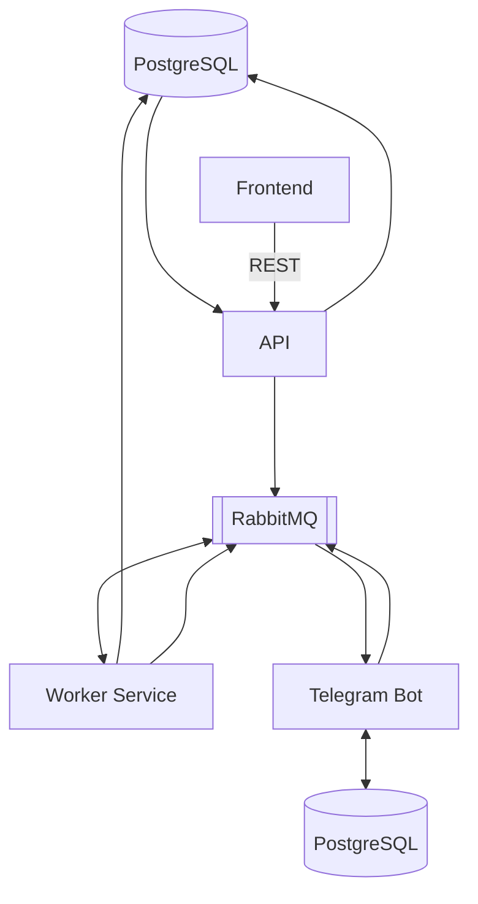

# Проект для изучения [Mermaid](https://mermaid.js.org/) 

```mermaid
flowchart TB
    mainDb[(PostgreSQL)]
    botDb[(PostgreSQL)]
    api[API]
    service[Worker Service]
    botService[Telegram Bot]
    broker[[RabbitMQ]]
    frontend[Frontend]

botService <--> botDb
api ---> mainDb
mainDb ---> api
service ---> mainDb
frontend --"REST"--> api ---> broker <--> service
service ---> broker
botService ---> broker
broker ---> botService
```
